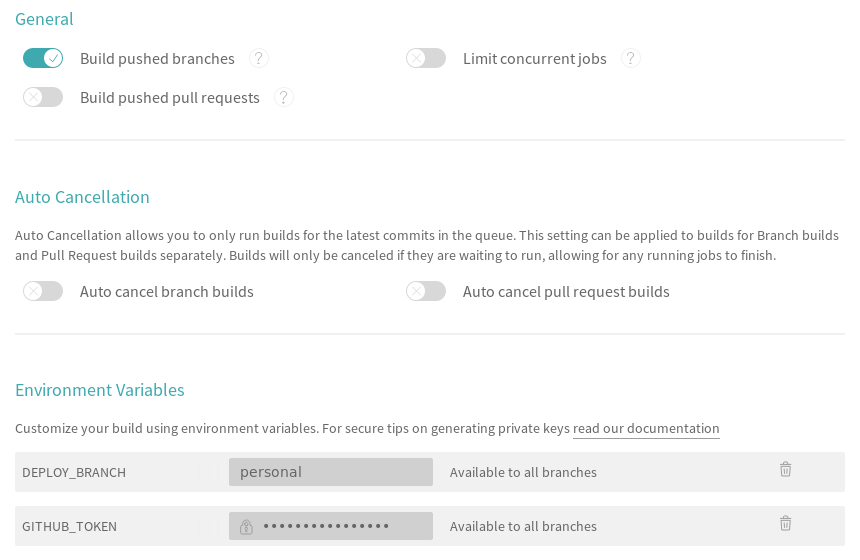

# aurci

Use [Travis CI] for building and packaging a few [AUR] packages and deploy them
to GitHub Releases so it can be used as repository in [Arch Linux].

## Forking repository

For build the [AUR] packages of your election:

- Fork this GitHub repository.
- [Enable Travis CI] on it.
- Switch to a new personal branch, e.g.: `git checkout -b personal` (*)
- Edit `pkglist`.
- Generate a [personal access token] with scope `public_repo`.

On [Travis CI] repository settings:

- Disable build pull request updates, for security.
- Add a `GITHUB_TOKEN`  environment variable with the personal access token code
  as value and set it as hidden.
- Add a `DEPLOY_BRANCH` environment variable
  with the name of your personal branch as value. (*)
- Optionally, enable a cron job in Travis CI repository settings.

(*) These two simple steps was added to let the `master` repository to remain
    clean to permit possible future contributions if you'll need to propose
    a new feature.

## Use repository

For user-specific instructions enable `gh-pages` on your fork, or check [here]
for generic ones.

[Arch Linux]: https://www.archlinux.org/
[AUR]:        https://aur.archlinux.org/
[here]:       https://localnet.github.io/aurci/
[Travis CI]:  https://travis-ci.com/

[personal access token]: https://github.com/settings/tokens/new
[Enable Travis CI]:      https://github.com/settings/installations
